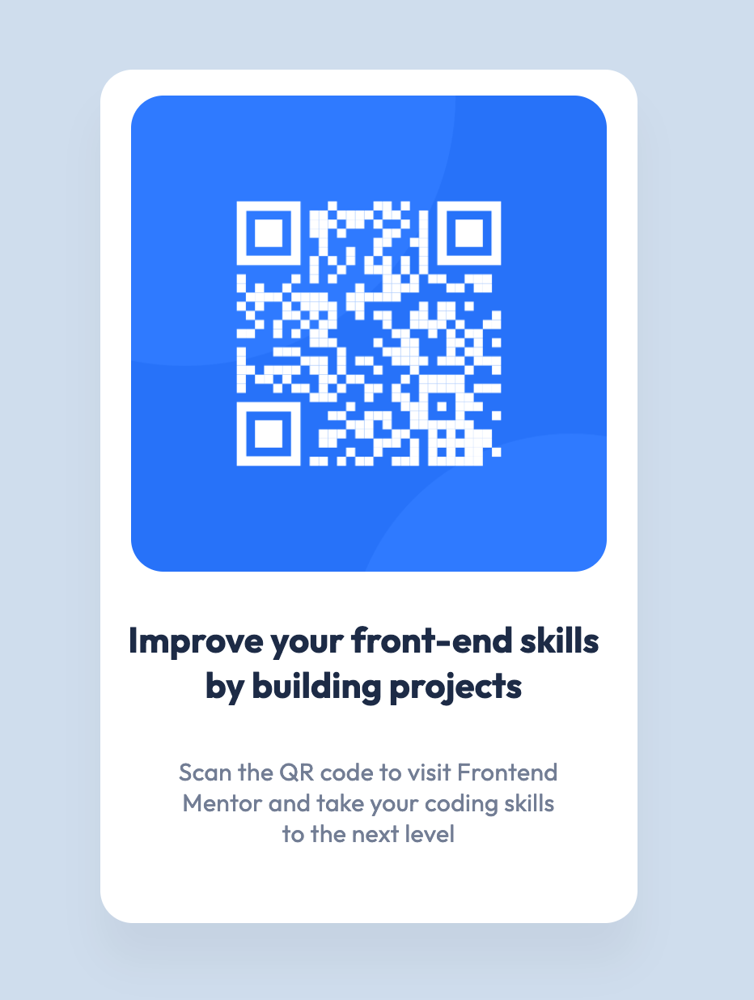

# Frontend Mentor - QR code component solution

This is a solution to the [QR code component challenge on Frontend Mentor](https://www.frontendmentor.io/challenges/qr-code-component-iux_sIO_H). Frontend Mentor challenges help you improve your coding skills by building realistic projects. 

## Table of contents

- [Overview](#overview)
  - [Screenshot](#screenshot)
- [My process](#my-process)
  - [Built with](#built-with)
  - [What I learned](#what-i-learned)
  - [Continued development](#continued-development)
  - [Useful resources](#useful-resources)
- [Author](#author)

## Overview
A very simple card component made with HTML5, Sass and built with Parcel.
### Screenshot

## My process

### Built with

- Semantic HTML5 markup
- Sass
- Flexbox
- CSS Grid
- Mobile-first workflow

### What I learned

After working with so much ReactJS, I wanted to go back to my roots and see if I could still build something with the basics. This was my first time using Parcel, which I prefer to gulp for small projects. I have also been using Bootstrap grid almost exclusively in my career and wanted a refresher on CSS grid and flexbox. 

### Continued development

I like to have a library of front-end components, like this card, that I can use in other projects. 

### Useful resources

- [Diferent Ways to Center a Dev in a Webpage](https://dev.to/ayushmanbthakur/different-ways-to-center-a-div-in-a-webpage-5enn) - A nice succint article with multiple ways to center a div, easy to read if you're dusting off some cobwebs when it comes to CSS.
- [A complete Guide to Grid](https://css-tricks.com/snippets/css/complete-guide-grid/) - You can never go wrong with CSS tricks.

## Author

- Frontend Mentor - [@laynet](https://www.frontendmentor.io/profile/laynet)
- Twitter - [@laynerzzzz](https://twitter.com/laynerzzzz)

